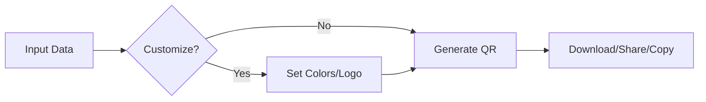

# **📌 Sharoobi QR Generator Pro**  
### **🚀 Developed Exclusively for CEC (China services students Corporation)**  

 

---

## **✨ Key Features**  

### **🔹 Enterprise-Grade QR Generation**  
✅ **Multi-format support** (URLs, text, WiFi, contacts)  
✅ **High-resolution export** (Up to 5000×5000px)  
✅ **Smart error correction** (L/M/Q/H levels)  
✅ **Batch processing** (Generate multiple codes at once)  

### **🎨 Advanced Customization**  
🎭 **Dynamic color control** (QR + background)  
🖼️ **Logo embedding** (Circular/square, 15%-30% sizing)  
🔄 **Transparent PNG export** (For professional designs)  
📐 **Custom dimensions** (150px to 5000px)  

### **⚡ Productivity & Security**  
📂 **Local history** (Last 50 generated codes)  
🔒 **Anti-copy protection** (Right-click & source code lock)  
📤 **One-click sharing** (Social media, email, messaging)  
📊 **Usage analytics** (Coming in v2.0)  

---

## **🚀 How to Use**  

### **1️⃣ Enter Content**  
- Paste **text, URL, or contact details**  
- Select **content type** (Standard/WiFi/Contact)  

### **2️⃣ Customize (Optional)**  
- 🎨 **Change QR & background colors**  
- 🖼️ **Upload a logo** (PNG/JPG recommended)  
- ⚙️ **Adjust error correction** (For damaged QR readability)  

### **3️⃣ Generate & Export**  
- **Download** (PNG/JPG, transparent/opaque)  
- **Copy** (Direct to clipboard)  
- **Share** (Via social media/email)  



---

## **🔒 Security & Protection**  
### **🛡️ Anti-Theft Measures**  
✔ **Right-click disabled** (Prevents code theft)  
✔ **Ctrl+U/Ctrl+S blocked** (Source code protection)  
✔ **Console watermarking** (Developer signature)  
✔ **Copy-paste detection** (Alerts on bulk copying)  

### **👨‍💻 Developer Verification**  
```javascript
console.log("%c=== CEC LICENSED PROJECT ===", "color: gold; font-weight: bold;");
console.log("%c🔐 Project ID: CEC-QR-8878", "color: #00ffe0;");
console.log("%c👨‍💻 Developer: Sharoobi", "color: #8a2be2;");
console.log("%c🌐 GitHub: github.com/sharoobi", "color: #ffd700;");
```

---

## **📜 License & Legal**  
### **Developed under contract for CEC China**  
🚫 **No unauthorized redistribution**  
✅ **Allowed for internal CEC use**  
📧 **Contact CEC or Sharoobi IT Dept. for licensing:**  
📧 Email: `support@cec.com`  

---

## **🤝 Contribution & Support**  
### **For CEC Internal Teams Only**  
🔧 **Bug reports:** Submit via CEC’s Jira system  
💡 **Feature requests:** Contact CEC IT Innovation Lab  

---

## **📌 Technical Specs**  
| **Category**       | **Details**                     |
|--------------------|---------------------------------|
| Engine             | QRCode.js v1.5.1                |
| Max Resolution     | 5000×5000px                     |
| Export Formats     | PNG, JPG (Transparent/Opaque)   |
| Compliance         | ISO/IEC 18004:2015 Standard     |

---

### **✨ Signature**  
<div align="center">
  <p><b>Developed with ❤️ by <a href="https://github.com/sharoobi">Sharoobi</a></b></p>
  <p><b>Exclusively for China Electronics Corporation (CEC)</b></p>
</div>


---

### **🔎 Why This Project?**  
- Built for **CEC’s internal document-tracking system**  
- Optimized for **high-volume QR generation**  
- Secure, fast, and **enterprise-ready**  


